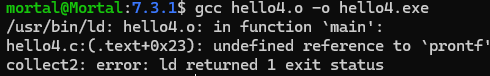
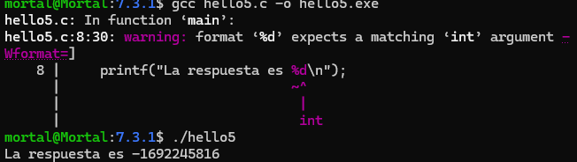
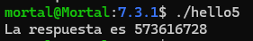
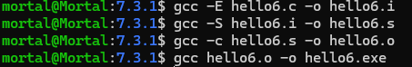
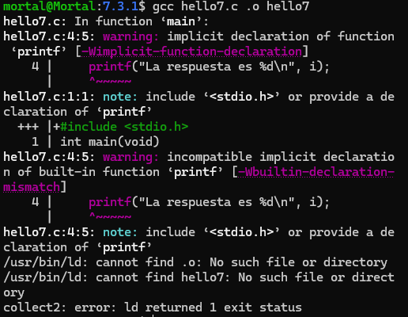

# Fases de la Traducción y Errores

 Este trabajo tiene como objetivo identificar las fases del proceso de traducción o
 Build y los posibles errores asociados a cada fase.
 Para lograr esa identificación se ejecutan las fases de traducción una a una, se
 detectan y corrigen errores, y se registran las conclusiones en readme.md.
 No es un trabajo de desarrollo; es más, el programa que usamos como ejemplo es
 simple, similar a hello.c pero con errores que se deben corregir. La complejidad
 está en la identificación y comprensión de las etapas y sus productos.

## 7.3. Tareas

# 1. La primera tarea es investigar las funcionalidades y opciones que su implementación, es decir su compilador, presenta para limitar el inicio y fin de las fases de traducción.
Las funcionalidades y opciones del compilador/implementador, se pueden ver en las siguientes 4 fases de traducción:

0-Archivo.c

->

1-Preprocesador: Se sustituyen todas las macros y se eliminan los comentarios. (.i)

->

2-Compilador: Se convierte el código preprocesador en código ensamblador (.s)

->

3-Asembler: Convierte el código ensamblador en código maquina o fichero objeto (.o)

->

4-Enlazador: Une los archivos objeto con las bibliotecas necesarias para crear un ejecutable funcional.

# ¿Cómo limitamos el inicio y fin de las fases de traducción?
0-Archivo.c

->

1-Preprocesador (-E): Detiene el programa después de que se completa el preprocesamiento

->

2-Compilador (-S): Compila el archivo (.i) y no se ensamblará para generar el código ensamblador

->

3-Asembler (-c): Genera un archivo objeto en lenguaje máquina (.o)

->

4-Enlazador: Por defecto, sin ningún flag adicional (gcc archivo.o -o ejecutable), completa el proceso de enlazado para generar el ejecutable final 

# 2. La siguiente tarea es poner en práctica lo que se investigó. Para eso se debe transcribir al readme.md cada comando ejecutado y su resultado o error correspondiente a la siguiente secuencia de pasos. También en readme.md se vuelcan las conclusiones y se resuelven los puntos solicitados. Para claridad, mantener en readme.md la misma numeración de la secuencia de pasos.

# ·[7.3](./7.3/)

### 7.3.1 Tareas
# 1. Preprocesador
   

# a.
```c
#include <stdio.h>
int/*medio*/main(void){
 int i=42;
 prontf("La respuesta es %d\n");
}
```
# b.
·[7.3.1](./7.3.1/hello2.i)

1: El preprocesador modifica el código fuente (hello.c).

2: El archivo es significativamente más grande y con más contenido, esto se debe al uso de librerías.

3: El preprocesador elimina los comentarios, haciendo más legible el código para el compilador.

# c.
```
int printf(const char * restrict s, ...);
int main(void){
 int i=42;
 prontf("La respuesta es %d\n");
```

·Análisis semántico de la linea 1:

int: Especifica el tipo de dato que va a retornar la función printf

printf(): Nombre de la función

const: Calificador de tipo, indica que el dato señalado por el puntero no puede ser modificado mediante ese puntero

char*restrict: Define el tipo de parámetro s, como un puntero a caracteres

s: Nombre del parámetro

...: lista de argumentos variadicos

# e.
```
/*.c*/
int printf(const char *restrict s, ...);

int main(void)
{
    int i = 42;
    prontf("La respuesta es %d\n");

/*.i*/

# 0 "hello3.c"
# 0 "<built-in>"
# 0 "<command-line>"
# 1 "/usr/include/stdc-predef.h" 1 3 4
# 0 "<command-line>" 2
# 1 "hello3.c"
int printf(const char *restrict s, ...);

int main(void)
{
    int i = 42;
    prontf("La respuesta es %d\n");
```
Las diferencias son:
1. El preprocesador agrego información para el compilador
   - (#0 "hello3.c") índica el inicio del código fuente (.c) y el 0 indica que es el contexto principal
   - (#0"< built-in>") procesa def internas o macros predefinidas del compilador
   - (#0"< command-line>") procesa opciones o def pasadas desde la linea de comandos
   - (#1"/usr/include/stdc-predef.h" 1 3 4) muestra que incluyo el encabezado
   - (#0"< command-line>" 2) Regresa el contexto
   - (#1 "hello3.c") vuelve al archivo fuente original para continuar el preprocesamiento
  
  0: Marca el inicio de un contexto o archivo principal.

  1: Marca el inicio de un archivo incluido por el preprocesador.
# 2. compilacion
# a.

# b.
·[7.3.1](./7.3.1/hello4.i)

léxico: (prontf)

sintético: }

semántico: i

# c.
En primer lugar, LCO, LFB0 y LFE0. Se llaman " etiquetas " y representan la ubicación, en memoria, de la siguiente instrucción o dato.
```
.text: indica que empieza la sección de código 

.section .rodata: define un string de solo lectura

.LC0:
  .string "la respuesta es %d\n" define la etiqueta LC0, que contiene el string de formato que se va a usar en prinf

|.text 
|.globl main
|.type main, @function

declara la funcion main como simbolo global, y abajo comienza su definición

.LFB0:
	.cfi_startproc   -> instrucciones para depuradores
	endbr64 -> seguridad 

	pushq	%rbp -> guarda el valor actual de la base del stack

	.cfi_def_cfa_offset 16
	.cfi_offset 6, -16
	movq	%rsp, %rbp -> establece una nueva base stack

	.cfi_def_cfa_register 6
	subq	$16, %rsp  -> reserva 16 bytes en la pila para variables locales

    movl	$42, -4(%rbp) -> guarda el numero 42 en una variable local en la pila, posición: -4(%rbp).

    movl	-4(%rbp), %eax -> carga ese valor 42 en el registro eax (32 bits, registro general)

    movl	%eax, %esi -> prepara el primer argumento para printf en el registro %esi

    leaq	.LC0(%rip), %rax -> carga la dirección del string
    movq	%rax, %rdi -> Pone esa dirección como primer argumento para printf

    movl	$0, %eax -> Limpia %eax

    call prontf@PLT -> llama a prontf
  
    movl	$0, %eax -> devuelve 0 como valor de retorno

    leave -> Es una forma de restaurar el stack antes de salir de la función

    ret -> Sale de la función y vuelve al sistema operativo.

    .size	main, .-main
    .ident	"GCC: (Ubuntu 13.3.0-6ubuntu2~24.04) 13.3.0"
     indica el tamaño de la función main 

    .section	.note.GNU-stack,"",@progbits
    .section	.note.gnu.property,"a"
    Seguridad: evita que la pila sea ejecutable
```

main: 

1- reserva espacio en la pila

2- Guarda el valor 42 en una variable local

3- carga ese valor en registros para pasarlo a la función de impresión

4- llama a prontf@PLT 

5- devuelve 0 (exit code)


# vinculacion 
# a.
Vincular hello4.o con la biblioteca estándar y generar el ejecutable.

El ejecutable no se puede generar debido a que encuentra un error léxico en la declaración de la función, el enlazador no encuentra la función prontf en la biblioteca estándar
# b.
Corregir en hello5.c y generar el ejecutable. Solo corregir lo necesario
para que vincule.

el ejecutable no se puede crear debido a un wearning, pero puede ejecutarse.
# c.
Ejecutar y analizar el resultado

el resultado es un numero random, ya que no tiene asignado un valor entero.

# Correción de bug


# 5. Remoción de prototipo
# a. 

# b.
i. ¿Arroja error o warning?

Arroja los dos, 2 warnings y 1 error

ii. ¿Qué es un prototipo y de qué maneras se puede generar?
Un prototipo de función es una declaración anticipada de una función, que informa al compilador su nombre, tipo de retorno y parámetros esperados.
```
return_type function_name(datatype parameter1, datatype parameter2, datatype parameter3………………)
{
// function body
}
For Example :
int sum(int a, int b)
{
return a + b;
}
```
Se puede generar de dos maneras:

·Incluyendo un encabezado (header), por ejemplo: #include < stdio.h >.

·Escribiendo manualmente la declaración antes de usar la función.

El compilador utiliza prototipos de función para comprobar la corrección de las llamadas a funciones y proporcionar verificación de tipos para evitar que se pasen tipos de datos incompatibles a las funciones. Los prototipos de función suelen ubicarse en los archivos de encabezado o al principio del código, antes de la función principal. También ayudan a detectar posibles errores en tiempo de compilación, en lugar de en tiempo de ejecución.  

iii. ¿Qué es una declaración implícita de una función?

Es cuando se usa una función sin haber declarado previamente su prototipo. Por ejemplo, si el compilador encuentra una sentencia como:

``` sum += convert(line); ```

El compilador asume una firma genérica (por ejemplo, que retorna int) y no verifica los argumentos.

En C99 y versiones posteriores, la declaración implícita está prohibida.

iv. ¿Qué indica la especificación?

Según el estándar C99 y posteriores, toda función debe estar declarada antes de ser utilizada.

La declaración implícita fue permitida en C90, pero está prohibida desde C99.

v. ¿Cómo se comportan las principales implementaciones?

GCC: Permite la declaración implícita solo en modos compatibles con C90, pero lanza warning o error en C99/C11/C17 si no se incluye el prototipo.

Clang: Similar a GCC.

Con -std=c99 o superior, genera error sin el #include < stdio.h>.

vi. ¿Qué es una función built-in?

Son funciones que el compilador reconoce e implementa directamente, a veces con optimización especial.

printf no es una función built-in en C, aunque algunos compiladores pueden ofrecer versiones optimizadas.

Ejemplo de función built-in: __builtin_popcount.

vii.¿Conjeture la razón por la cual gcc se comporta como se comporta?¿Va realmente contra la especificación?

Conjetura: GCC mantiene retrocompatibilidad con código escrito en C90 o versiones más antiguas.

Por eso permite la declaración implícita por defecto, aunque emite warnings.

No va contra la especificación si se compila en modo C90. Pero sí viola C99 en adelante, por eso en esos modos da error.

# bibliografía:

https://www.alegsa.com.ar/Diccionario/C/25059.php#gsc.tab=0

https://www.guru99.com/es/compiler-design-phases-of-compiler.html

https://programmerclick.com/article/38531616876/


https://www.reddit.com/r/learnprogramming/comments/18m6lp/x86_asm_confusion_over_gcc_generated_assemblygas/?rdt=54289

https://cs.lmu.edu/~ray/notes/x86assembly/

https://pacman128.github.io/static/pcasm-book.pdf

https://en.cppreference.com/w/c/io/fprintf

https://rodrigocadiz.github.io/SD-Notebooks/SD-D-Assembly.html

https://www.shiksha.com/online-courses/articles/function-prototype-in-c/#:~:text=The%20syntax%20for%20a%20C,%E2%80%A6%E2%80%A6%E2%80%A6%E2%80%A6%E2%80%A6%E2%80%A6)&text=In%20this%20function%20prototype%2C%20we,type%20of%20the%20function%3A%20integer

https://www.zator.com/Cpp/E4_4_3.htm