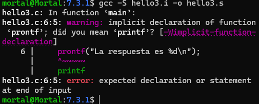
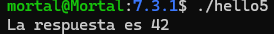

# Fases de la Traducción y Errores

 Este trabajo tiene como objetivo identificar las fases del proceso de traducción o
 Build y los posibles errores asociados a cada fase.
 Para lograr esa identificación se ejecutan las fases de traducción una a una, se
 detectan y corrigen errores, y se registran las conclusiones en readme.md.
 No es un trabajo de desarrollo; es más, el programa que usamos como ejemplo es
 simple, similar a hello.c pero con errores que se deben corregir. La complejidad
 está en la identificación y comprensión de las etapas y sus productos.

## 7.3. Tareas

# 1. La primera tarea es investigar las funcionalidades y opciones que su implementación, es decir su compilador, presenta para limitar el inicio y fin de las fases de traducción.
Las funcionalidades y opciones del compilador/implementador, se pueden ver en las siguientes 4 fases de tradución:

0-Archivo.c

->

1-Preprocesador: Se sustituyen todas las macros y se eliminan los comentarios. (.i)

->

2-Compilador: Se combierte el codigo preprocesado en codigo ensamblador (.s)

->

3-Asembler: Convierte el codigo ensamblador en codigo maquina o fichero objeto (.o)

->

4-Enlazador: Une los archivos objeto con las bibliotecas necesarias para crear un ejecutable funcional.

# ¿Cómo limitamos el inicio y fin de las fases de traducción?
0-Archivo.c

->

1-Preprocesador (-E): Detiene el programa después de que se completa el preprocesamiento

->

2-Compilador (-S): Compila el archivo (.i) y no se ensamblará para generar el código ensamblador

->

3-Asembler (-c): Genera un archivo objeto en lenguaje máquina (.o)

->

4-Enlazador: Por defecto, sin ningún flag adicional (gcc archivo.o -o ejecutable), completa el proceso de enlazado para generar el ejecutable final 

# 2. La siguiente tarea es poner en práctica lo que se investigó. Para eso se debe transcribir al readme.md cada comando ejecutado y su resultado o error correspondiente a la siguiente secuencia de pasos. También en readme.md se vuelcan las conclusiones y se resuelven los puntos solicitados. Para claridad, mantener en readme.md la misma numeración de la secuencia de pasos.

# ·[7.3](./7.3/)

### 7.3.1 Tareas
# 1. Preprocesador
   

# a.
```c
#include <stdio.h>
int/*medio*/main(void){
 int i=42;
 prontf("La respuesta es %d\n");
}
```
# b.
·[7.3.1](./7.3.1/hello2.i)

1: El preprocesador modifica el código fuente (hello.c).

2: El archivo es significativamente más grande y con más contenido, esto se debe al uso de librerías.

3: El preprocesador elimina los comentarios, haciendo más legible el código para el compilador.

# c.
```
int printf(const char * restrict s, ...);
int main(void){
 int i=42;
 prontf("La respuesta es %d\n");
```

·Analisis semantico de la linea 1:

int: Especifica el tipo de dato que va a retornar la funcion printf

printf(): Nombre de la funcion

const: Calificador de tipo, indica que el dato señalado por el puntero no puede ser modificado atraves de ese puntero

char*restrict: Define el tipo de parametro s, como un puntero a caracteres

s: Nombre del parametro

...: lista de argumnetos variadicos

# e.
```
/*.c*/
int printf(const char *restrict s, ...);

int main(void)
{
    int i = 42;
    prontf("La respuesta es %d\n");

/*.i*/

# 0 "hello3.c"
# 0 "<built-in>"
# 0 "<command-line>"
# 1 "/usr/include/stdc-predef.h" 1 3 4
# 0 "<command-line>" 2
# 1 "hello3.c"
int printf(const char *restrict s, ...);

int main(void)
{
    int i = 42;
    prontf("La respuesta es %d\n");
```
Las diferencias son:
1. El preprocesador agrego información para el compilador
   - (#0 "hello3.c") inidica el inicio del codigo funete (.c) y el 0 indica que es el contexto principal
   - (#0"< built-in>") procesa def internas o macros prefedinidas del compilador
   - (#0"< command-line>") procesa opciones o def pasadas desde la linea de comandos
   - (#1"/usr/include/stdc-predef.h" 1 3 4) muestra que incluyo el encabezado
   - (#0"< command-line>" 2) Regresa el contexto
   - (#1 "hello3.c") vuelve al archivo fuente original para continuar el preprocesamiento
  
  0: Marca el inicio de un contexto o archivo principal.

  1: Marca el inicio de un archivo incluido por el preprocesador.
# 2. compilacion
# a.

# b.
·[7.3.1](./7.3.1/hello4.i)

error: lexico (prontf)

sintatico: }

semantico: i

# c.
En primer lugar, LCO, LFB0 y LFE0. Se llaman " etiquetas " y representan la ubicación, en memoria, de la siguiente instrucción o dato.
```
	.file	"hello4.c"
	.text
	.section	.rodata
.LC0:
	.string	"La respuesta es %d\n"
	.text
	.globl	main
	.type	main, @function
main:
.LFB0:
	.cfi_startproc
	endbr64
	pushq	%rbp
	.cfi_def_cfa_offset 16
	.cfi_offset 6, -16
	movq	%rsp, %rbp
	.cfi_def_cfa_register 6
	subq	$16, %rsp
	movl	$42, -4(%rbp)
	movl	-4(%rbp), %eax
	movl	%eax, %esi
	leaq	.LC0(%rip), %rax
	movq	%rax, %rdi
	movl	$0, %eax
	call	prontf@PLT
	movl	$0, %eax
	leave
	.cfi_def_cfa 7, 8
	ret
	.cfi_endproc
.LFE0:
	.size	main, .-main
	.ident	"GCC: (Ubuntu 13.3.0-6ubuntu2~24.04) 13.3.0"
	.section	.note.GNU-stack,"",@progbits
	.section	.note.gnu.property,"a"
	.align 8
	.long	1f - 0f
	.long	4f - 1f
	.long	5
0:
	.string	"GNU"
1:
	.align 8
	.long	0xc0000002
	.long	3f - 2f
2:
	.long	0x3
3:
	.align 8
4
```
.text: indica que empieza la seccion de codigo 
.section .rodata: define un string de solo lectura
.LC0: 
  .string "la respuesta es %d\n" define la etiqueta LC0, que contiene el string de formato que se va a usar en prinf
|.text 
|.globl main
|.type main, @function
declara la funcion main como simbolo global, y abajo comienza su definicion
.LFB0:
	.cfi_startproc   -> instruciones para depuradores
	endbr64 -> seguridad
	pushq	%rbp -> guarda el valor actual de la base del stack
	.cfi_def_cfa_offset 16
	.cfi_offset 6, -16
	movq	%rsp, %rbp -> establece una nueva base stack
	.cfi_def_cfa_register 6
	subq	$16, %rsp  -> reserva 16 bytes en la pila para variables locales

    movl	$42, -4(%rbp) -> guarda el numero 42 en una variable local en la pila, posicion: -4(%rbp).

    movl	-4(%rbp), %eax -> carga ese valor 42 en el registro eax (32 bits, registro general)

    movl	%eax, %esi -> prepara el primer argumento para printf en el registro %esi

    leaq	.LC0(%rip), %rax -> carga la direccion del string
    movq	%rax, %rdi -> Pone esa dirección como primer argumento para printf

    movl	$0, %eax -> Limpia %eax

    call prontf@PLT -> llama a prontf
    
    movl	$0, %eax -> devuelve 0 como valor de retorno

    leave -> Es una forma de restaurar el stack antes de salir de la función

    ret -> Sale de la función y vuelve al sistema operativo.

    .size	main, .-main
    .ident	"GCC: (Ubuntu 13.3.0-6ubuntu2~24.04) 13.3.0"
     indica el tamaño de la funcion main 

    .section	.note.GNU-stack,"",@progbits
    .section	.note.gnu.property,"a"
    Seguridad: evita que la pila sea ejecutable
main: 
1- reserva espacio en la pila
2- Guarda el valor 42 en una variable local
3- carga ese valor en registros para pasarlo a la funcion de impresion
4- llama a prontf@PLT 
5- devuelve 0 (exit code)
# vinculacion 
# a.

# b.

# c.

# bibliografia:

https://www.alegsa.com.ar/Diccionario/C/25059.php#gsc.tab=0

https://www.guru99.com/es/compiler-design-phases-of-compiler.html

https://programmerclick.com/article/38531616876/